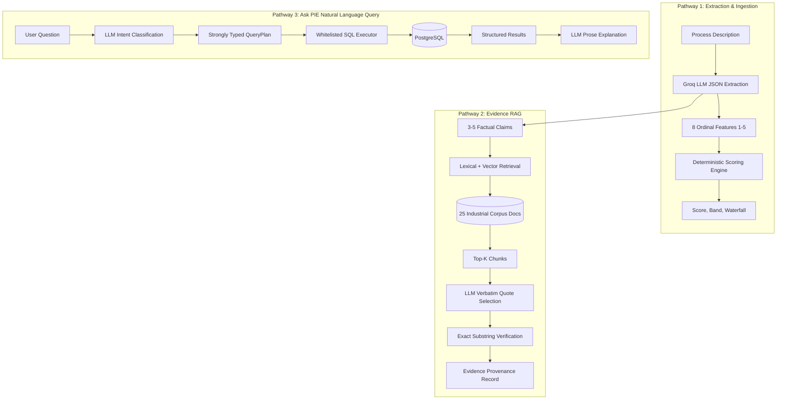
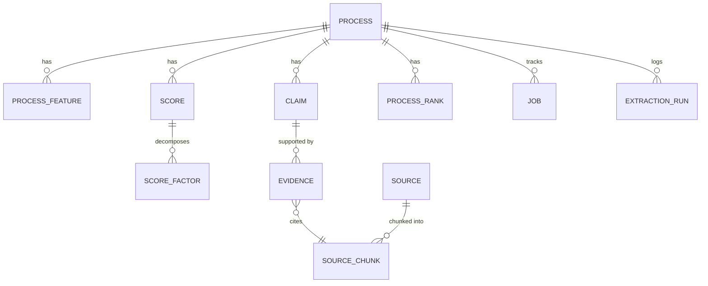

# 🏛️ Process Intelligence Engine (PIE) — Technical Documentation

> **Stage 2 AI Application Submission — MODUS Enterprise AI Build Challenge**  
> **Repository:** `https://github.com/vishsharmaa/PIE-process-intelligence-engine-`  
> **Core Architectural Invariant:** *"AI interprets unstructured text. Deterministic software makes business decisions."*  

---

## 📑 Table of Contents

1. [Executive Summary](#1-executive-summary)
2. [Business Problem](#2-business-problem)
3. [Solution Overview](#3-solution-overview)
4. [Core Design Philosophy](#4-core-design-philosophy)
5. [System Architecture](#5-system-architecture)
6. [AI Architecture](#6-ai-architecture)
7. [Technology Stack](#7-technology-stack)
8. [The 9-Stage Ingestion Pipeline](#8-the-9-stage-ingestion-pipeline)
9. [LLM Responsibilities & Boundaries](#9-llm-responsibilities--boundaries)
10. [Deterministic Responsibilities](#10-deterministic-responsibilities)
11. [Scoring Engine & Invariants](#11-scoring-engine--invariants)
12. [YAML Rubric Specification](#12-yaml-rubric-specification)
13. [RAG & Research Pipeline](#13-rag--research-pipeline)
14. [Evidence Verification & Provenance](#14-evidence-verification--provenance)
15. [Natural Language Query Architecture (Ask PIE)](#15-natural-language-query-architecture-ask-pie)
16. [QueryPlan Security Model (Zero Text-to-SQL)](#16-queryplan-security-model-zero-text-to-sql)
17. [Database Design & Data Model](#17-database-design--data-model)
18. [pgvector Usage & Semantic Indexing](#18-pgvector-usage--semantic-indexing)
19. [Frontend Architecture & UI Engineering](#19-frontend-architecture--ui-engineering)
20. [Background Jobs & Asynchronous Processing](#20-background-jobs--asynchronous-processing)
21. [Idempotency & Deduplication](#21-idempotency--deduplication)
22. [Error Handling & Self-Repair Patterns](#22-error-handling--self-repair-patterns)
23. [Explainability & Visual Factor Waterfalls](#23-explainability--visual-factor-waterfalls)
24. [Automated Testing & Invariant Validation](#24-automated-testing--invariant-validation)
25. [Deployment Architecture](#25-deployment-architecture)
26. [Scalability & Concurrency Considerations](#26-scalability--concurrency-considerations)
27. [Security & Safety Considerations](#27-security--safety-considerations)
28. [Known Limitations](#28-known-limitations)
29. [Future Improvements & Roadmap](#29-future-improvements--roadmap)

---

## 1. Executive Summary

The **Process Intelligence Engine (PIE)** is an enterprise-grade AI decision platform that converts **unstructured natural language descriptions of business and industrial processes** into **structured, evidence-backed transformation intelligence**.

In modern enterprises, prioritizing processes for automation, AI augmentation, or human-led redesign is bottlenecked by manual, subjective consulting audits. PIE solves this by implementing an objective, auditable, and deterministic decision engine powered by bounded Large Language Model (LLM) feature extraction and Retrieval-Augmented Generation (RAG).

PIE ingests raw process text, extracts bounded ordinal ratings (1–5) and factual claims, verifies claims against a 25-document industrial engineering corpus using lexical and vector retrieval with exact substring quote matching, computes deterministic scores and signed factor contributions using a configurable YAML rubric, and dynamically updates portfolio rankings and percentiles across 100+ processes.

---

## 2. Business Problem

Enterprise operational transformations routinely face three critical failure modes:
1. **Subjective Prioritization:** Automation decisions are driven by executive hype or vendor sales pitches rather than verifiable data availability and rule clarity.
2. **Hallucinated Recommendations:** Pure LLM "chatbots" hallucinate numerical scores, miscalculate portfolio percentiles, and generate plausible-sounding but unverifiable recommendations.
3. **Safety & Regulatory Blindspots:** Generative models often recommend full automation for processes subject to stringent safety regulations (e.g., FDA GMP, OSHA, ISO standards) without hard safety constraints.

Organizations require a system that combines the **comprehension power of LLMs** with the **auditable rigor, mathematical predictability, and safety controls of enterprise software**.

---

## 3. Solution Overview

PIE bridges this gap by enforcing a strict architectural boundary:
- **Natural Language Comprehension:** Groq-hosted Llama-3.1-8B extracts structured ratings on 8 standardized operational dimensions and generates factual claims.
- **Ground-Truth Evidence Verification:** Claims are retrieved against an industrial corpus via `pgvector` and verified using strict verbatim quote substring checks.
- **Deterministic Mathematical Scoring:** A Python scoring engine calculates signed factor contributions and total scores (0–100), assigns decision bands (`Automate`, `Augment`, `Human-Led`), and enforces hard safety overrides.
- **Auditable Query Interface:** "Ask PIE" translates business queries into typed `QueryPlan` schemas and executes pre-compiled, parameterized SQL queries—completely eliminating arbitrary text-to-SQL generation.

```
┌─────────────────────────┐     ┌────────────────────────┐     ┌────────────────────────┐
│ Raw Process Description │ ──▶ │ 9-Stage Ingestion      │ ──▶ │ Verified Intelligence  │
│ (Unstructured Text)     │     │ Pipeline + RAG Verify  │     │ Score, Band, Waterfall│
└─────────────────────────┘     └────────────────────────┘     └────────────────────────┘
```

---

## 4. Core Design Philosophy

### *"AI interprets. Deterministic software decides."*

Every component in PIE reflects this division of responsibility:

| Component | Responsible Subsystem | Rationale |
|---|---|---|
| Feature Extraction | LLM (Groq / Llama 3) | Natural language text understanding and semantic interpretation |
| Claim Generation | LLM (Groq / Llama 3) | Identifying key factual propositions within process narratives |
| Quote Selection | LLM (Groq / Llama 3) | Selecting verbatim text segments from retrieved corpus chunks |
| Intent Routing | LLM (Groq / Llama 3) | Classifying natural language questions into closed intent categories |
| Score Calculation | Pure Python Engine | Mathematical precision, zero hallucination, repeatable results |
| Factor Contribution | Pure Python Engine | Linear additive scoring invariant $\sum \text{Contribution}_f = \text{Score}$ |
| Band Assignment | Pure Python Engine | Explicit thresholding ($\ge 70$, $45–69$, $<45$) |
| Safety Overrides | Pure Python Engine | Hardcoded regulatory caps that override numerical scores |
| Evidence Verification | Pure Python Engine | Exact normalized substring matching against source text |
| Query Execution | SQLAlchemy ORM | Parameterized SQL execution; immune to prompt injection |
| Portfolio Ranking | Pure Python Engine | Exact order statistics and percentile distributions |

---

## 5. System Architecture

PIE is architected as a decoupled, multi-tiered enterprise system:

```
[ Presentation Tier ]  React 18 + TypeScript + Vite + TanStack Query + Recharts
         │
         ▼  HTTPS / REST JSON
[ Application Tier ]   FastAPI 0.111.0 + Pydantic v2 + BackgroundTasks Worker
         │
         ├──────────────────────────────┬──────────────────────────────┐
         ▼                              ▼                              ▼
[ Probabilistic AI Tier ]    [ Deterministic Engine ]      [ Persistence Tier ]
• Groq API (Llama 3.1 8B)    • Rubric Scoring Engine       • PostgreSQL 16
• sentence-transformers      • Evidence Verifier           • pgvector (768-dim)
  (all-mpnet-base-v2)        • QueryPlan Dispatcher        • On-Disk Cache
```

Refer to the high-resolution architecture diagrams in `submission/architecture/system-architecture.pdf`.

---

## 6. AI Architecture

The intelligence layer consists of three isolated AI pathways:



---

## 7. Technology Stack

### Backend
- **Language:** Python 3.9+
- **Web Framework:** FastAPI 0.111.0 (ASGI, OpenAPI auto-docs)
- **Data Validation:** Pydantic 2.7.1 & Pydantic Settings 2.2.1
- **Database ORM:** SQLAlchemy 2.0.30 (Declarative Base, relationship mapping)
- **Database Driver:** `psycopg2-binary` 2.9.9
- **Vector Extensions:** `pgvector` 0.2.5
- **Database Migrations:** Alembic 1.13.1
- **LLM Client:** `openai` 1.30.1 (targeting `https://api.groq.com/openai/v1`)
- **Embeddings:** `sentence-transformers` 2.7.0 (`all-mpnet-base-v2`, 768-dim)
- **Configuration & Parsers:** PyYAML 6.0.1, python-dotenv 1.0.1

### Frontend
- **Framework:** React 19 / React 18 SPA
- **Language:** TypeScript 6.0
- **Build Tool:** Vite 8.2
- **State Management:** `@tanstack/react-query` 5.101.4 (server state caching & refetching)
- **Charts & Visualizations:** Recharts 3.10.1 (Pie, Bar, Area charts)
- **Design System:** Custom Dark Enterprise CSS (`index.css`, 695 lines, zero Tailwind runtime)

### Database & Infrastructure
- **RDBMS:** PostgreSQL 16 with `pgvector` extension
- **Containerization:** Docker & Docker Compose
- **Target Cloud:** Render (Backend), Vercel (Frontend), Neon / Supabase (PostgreSQL + pgvector)

---

## 8. The 9-Stage Ingestion Pipeline

Every process description flows through the 9-stage pipeline implemented in `app/pipeline/runner.py`:

```
┌────────────┐   ┌───────────┐   ┌───────────┐   ┌───────────┐   ┌────────────┐
│ 1.Validate │──▶│2.Normalize│──▶│ 3. Dedup  │──▶│4. Extract │──▶│ 5. Feature │
└────────────┘   └───────────┘   └───────────┘   └───────────┘   └────────────┘
                                                                        │
┌────────────┐   ┌───────────┐   ┌───────────┐   ┌───────────┐         │
│9.Portfolio │◀──│ 8.Persist │◀──│  7.Score  │◀──│6. Research│◀────────┘
└────────────┘   └───────────┘   └───────────┘   └───────────┘
```

1. **Stage 1: Validate (`validate.py`):** Ensures non-empty name ($\le 256$ chars) and description ($\ge 20$ chars). Fails gracefully on invalid input.
2. **Stage 2: Normalize (`normalize.py`):** Converts text to lowercase, collapses multiple whitespace runs, and strips punctuation.
3. **Stage 3: Deduplicate (Implicit / DB):** Computes SHA-256 hash of normalized text. Checks `process.content_hash` UNIQUE constraint to prevent duplicate processing.
4. **Stage 4: Extract (`extract.py`):** Invokes Groq JSON mode (`llama-3.1-8b-instant`) with `ExtractionResult` Pydantic schema to extract 8 factor ratings (1–5) and 3–5 factual claims.
5. **Stage 5: Features (`features.py`):** Normalizes ordinal ratings ($v_f = \frac{\text{ordinal} - 1}{4} \in [0.0, 1.0]$) and persists `ProcessFeature` records linked to the extraction run.
6. **Stage 6: Research (`research.py`):** For each claim, performs lexical search and dense vector search against corpus chunks, requests verbatim quotes via LLM, and verifies substring presence.
7. **Stage 7: Score (`score.py`):** Evaluates `rubric_v1.yaml` deterministically using `compute_score()`. Calculates signed factor contributions, applies safety overrides, and verifies invariant assertions.
8. **Stage 8: Persist (`persist.py`):** Transitions `Process.status` to `completed`.
9. **Stage 9: Portfolio (`portfolio.py`):** Recomputes overall portfolio rankings and percentiles across all scored processes.

---

## 9. LLM Responsibilities & Boundaries

The LLM is strictly bounded as follows:

- **Schema-Enforced JSON Mode:** All LLM extraction calls use OpenAI-compatible JSON schema mode. Free-form conversational output is disallowed.
- **Bounded Ordinal Outputs:** Factor ratings are strictly constrained to integers $\in \{1, 2, 3, 4, 5\}$ and confidence $\in [0.0, 1.0]$.
- **Zero Arithmetic Authority:** The LLM is never prompted to calculate a score, compute a percentage, or rank processes.
- **Deterministic Repair Retry:** If the LLM generates non-conforming JSON, a single schema repair retry is executed with the exact validation error before failing the stage.
- **On-Disk Extraction Cache:** Extraction results are cached in `.cache/extractions/` keyed by `SHA-256(model + prompt_version + normalized_text)` for rapid, zero-cost deterministic replay.

---

## 10. Deterministic Responsibilities

The Python engine possesses sole authority over:
1. **Mathematical Scoring:** Applying linear rubric weights and directional signs.
2. **Safety Rule Overrides:** Enforcing compliance constraints.
3. **Evidence Verification:** String normalization and exact substring search.
4. **Ranking & Percentile Calculations:** Order statistics over the portfolio database.
5. **SQL Query Construction:** Executing parameterized queries mapped from classified intents.

---

## 11. Scoring Engine & Invariants

Implemented in `app/scoring/engine.py`:

### Mathematical Formula
$$\text{Total Score} = \sum_{f \in \text{Factors}} \text{Contribution}_f$$

Where:
- $\text{ordinal}_f \in \{1, 2, 3, 4, 5\}$
- $\text{Normalized Value } v_f = \frac{\text{ordinal}_f - 1}{4.0} \in [0.0, 1.0]$
- **Driver Factors ($+$ direction):** $\text{Contribution}_f = w_f \times v_f \times 100$
- **Constraint Factors ($-$ direction):** $\text{Contribution}_f = w_f \times (1.0 - v_f) \times 100$

### Band Thresholds
- **Automate:** $\text{Total Score} \ge 70.0$
- **Augment:** $45.0 \le \text{Total Score} < 70.0$
- **Human-Led:** $\text{Total Score} < 45.0$

### Safety Override Rule
If `regulatory_safety_constraint == 5` AND `human_judgment_dependency >= 4`, the decision band is automatically capped at **Augment**, regardless of numerical score.

### Invariant Assertion
```python
real_factors = [f for f in result.factors if f.factor_key != "override_cap"]
factor_sum = round(sum(f.contribution for f in real_factors), 2)
assert abs(factor_sum - total_score) < 0.01
```

---

## 12. YAML Rubric Specification

Configured in `app/scoring/rubric_v1.yaml`:

```yaml
version: "v1"
factors:
  data_availability:
    direction: "+"
    weight: 0.18
    description: "Availability of structured, machine-readable data"
  process_repeatability:
    direction: "+"
    weight: 0.16
    description: "Degree of consistent, repeatable operational patterns"
  rule_clarity:
    direction: "+"
    weight: 0.14
    description: "Clarity and completeness of decision logic"
  volume_frequency:
    direction: "+"
    weight: 0.12
    description: "Execution frequency and transaction volume"
  digital_maturity:
    direction: "+"
    weight: 0.10
    description: "Current digital tooling and sensor integration"
  error_cost_tolerance:
    direction: "+"
    weight: 0.10
    description: "Tolerance for process errors (high = tolerant)"
  human_judgment_dependency:
    direction: "-"
    weight: 0.12
    description: "Need for nuanced human expertise and discretion"
  regulatory_safety_constraint:
    direction: "-"
    weight: 0.08
    description: "Regulatory oversight and safety criticality"
bands:
  automate_threshold: 70
  augment_threshold: 45
override:
  description: "If regulatory_safety_constraint==5 AND human_judgment_dependency>=4, cap band at Augment"
  regulatory_safety_constraint_eq: 5
  human_judgment_dependency_gte: 4
  cap_band: "Augment"
```

$\sum w_f = 0.18 + 0.16 + 0.14 + 0.12 + 0.10 + 0.10 + 0.12 + 0.08 = 1.00$

---

## 13. RAG & Research Pipeline

PIE incorporates an enterprise knowledge corpus of **25 industrial engineering documents** located in `app/corpus/`:
- Formats: Markdown with YAML frontmatter (`title`, `publisher`, `url`, `year`, `credibility_tier`).
- Topics: Predictive Maintenance (ISO 13373), IIoT Sensors (IEC 62443), Visual Quality (IPC-A-610), SPC (Six Sigma), MES Historians, Pharma GMP (21 CFR Part 11), Semiconductor Yield, Lean 5S, Supply Chain Traceability, and Safety EHS.

### Retrieval Mechanics
1. **Lexical Keyword Search:** Tokenizes query terms and scores corpus chunks by token frequency.
2. **Dense Vector Search:** Generates 768-dimensional embeddings via `all-mpnet-base-v2` and queries `source_chunk.embedding` using `pgvector` cosine distance (`<=>`).
3. **Hybrid Combination:** Lexical candidates are prioritized; vector similarity supplements candidates when lexical returns $< 3$ chunks.

---

## 14. Evidence Verification & Provenance

To eliminate RAG hallucinations, quote verification is deterministic:

```python
def verify_quote(quote: str, chunk_text: str) -> bool:
    if not quote or not chunk_text:
        return False
    return normalize(quote) in normalize(chunk_text)
```

1. LLM extracts a candidate quote from the top-retrieved chunk.
2. `verify_quote()` normalizes both strings (collapsing whitespace, lowercasing) and performs an exact substring match.
3. If true, `Evidence.verified` is set to `True` with method `exact_match`.
4. If false, `Evidence.verified` is set to `False` with method `unverified`.
5. The UI displays verified quotes with a green provenance tag and links to the source document, author, year, and URL.

---

## 15. Natural Language Query Architecture (Ask PIE)

"Ask PIE" enables natural language querying over the portfolio without SQL injection risks:

1. **Intent Classification:** Groq classifies the query into one of 7 whitelisted intents:
   - `rank_top`: Top/bottom processes by score
   - `filter_by_band`: Filter processes by band (`Automate`, `Augment`, `Human-Led`)
   - `explain_process`: Factor breakdown of a specific process
   - `portfolio_stats`: Aggregate distribution and average scores
   - `compare`: Comparative analysis between two processes
   - `open_research`: General transformation Q&A
   - `unmappable`: Out-of-domain questions
2. **QueryPlan Instantiation:** `build_plan()` populates a strongly typed Pydantic `QueryPlan`.
3. **Execution:** `app/query/executors.py` maps the `QueryPlan` to pre-compiled, parameterized SQLAlchemy queries.
4. **Prose Explanation:** The LLM generates a 2–3 sentence business summary explaining the returned numbers.

---

## 16. QueryPlan Security Model (Zero Text-to-SQL)

```
[ User Input ] ──▶ [ Intent Classifier ] ──▶ [ Pydantic QueryPlan ] ──▶ [ Pre-compiled SQL Executor ]
                                                    │                              │
                                            (Validated Bounds)             (Parameterized Only)
```

- **No Dynamic SQL:** The LLM never writes `SELECT`, `FROM`, `WHERE`, or raw SQL tokens.
- **Validated Bounds:** Parameters (such as `limit`) are clamped ($\le 50$) in Pydantic.
- **SQL Injection Impossible:** All database communication uses SQLAlchemy bound parameters.

---

## 17. Database Design & Data Model

The relational schema is implemented across 11 PostgreSQL tables:



Refer to `submission/architecture/database-er-diagram.pdf` for the complete entity-relationship diagram.

---

## 18. pgvector Usage & Semantic Indexing

- **Column:** `source_chunk.embedding VECTOR(768)`
- **Distance Metric:** Cosine distance operator (`<=>`)
- **Query Example:**
  ```sql
  SELECT id FROM source_chunk 
  WHERE embedding IS NOT NULL 
  ORDER BY embedding <=> :emb 
  LIMIT 5;
  ```
- Enables hybrid lexical-dense vector search over 25 industrial engineering reference texts.

---

## 19. Frontend Architecture & UI Engineering

- **Architecture:** Single Page Application (SPA) with hash-based routing (`/#/dashboard`, `/#/processes`, `/#/process/:id`, `/#/portfolio`, `/#/ingest`, `/#/ask`, `/#/methodology`).
- **Data Fetching:** TanStack Query handles caching, automatic background refetching, and request deduplication.
- **Visual Factor Waterfall:** Custom CSS grid component rendering positive driver bars (green/teal) and negative constraint bars (red/orange) to visualize factor contributions.
- **Design System:** Custom dark enterprise theme (`#0f1117` base, `#1a1d27` cards, `#6366f1` indigo accents) optimized for high data density and executive review.

---

## 20. Background Jobs & Asynchronous Processing

- Ingestion requests (`POST /api/processes`) immediately return `202 Accepted` with a `job_id`.
- FastAPI `BackgroundTasks` executes `run_pipeline(process_id, job_id)` in an asynchronous thread.
- Progress updates are committed to the `job` table after each stage:
  - 5% (validate) $\rightarrow$ 10% (normalize) $\rightarrow$ 20% (extract) $\rightarrow$ 40% (features) $\rightarrow$ 55% (score) $\rightarrow$ 70% (research) $\rightarrow$ 85% (persist) $\rightarrow$ 95% (portfolio) $\rightarrow$ 100% (complete).
- Frontend polls `GET /api/jobs/{id}` every 1,000ms until completion.

---

## 21. Idempotency & Deduplication

- **Text Normalization:** Lowercased, whitespace collapsed, punctuation stripped.
- **Content Hash:** `SHA-256(normalized_text)` stored in `process.content_hash` with a unique database index.
- **Ingestion Guard:** Duplicate submissions return `409 Conflict` containing the ID and name of the existing process.
- **Feature/Score Upserting:** Features and scores are stored with unique constraints on `(process_id, rubric_version)`, ensuring pipeline re-runs cleanly update existing records without orphan accumulation.

---

## 22. Error Handling & Self-Repair Patterns

- **Groq API Rate Limits (429):** Exponential backoff with jitter (4s, 8s retries).
- **JSON Schema Repair:** If initial LLM output fails Pydantic validation, a repair prompt containing the exact validation error is sent back to the LLM.
- **Graceful Fallbacks:** If embedding services or vector searches fail, the pipeline falls back to lexical retrieval without aborting the process lifecycle.
- **Pipeline Failure Isolation:** Pipeline errors catch exceptions, set `job.status = 'failed'`, populate `job.error`, and mark `process.status = 'extraction_failed'`, preserving full diagnostic logs.

---

## 23. Explainability & Visual Factor Waterfalls

Every score produced by PIE is 100% explainable:
1. **Factor Breakdown:** The exact numerical contribution of each of the 8 factors is displayed in an intuitive waterfall chart.
2. **Recommendation Rationale:** Top-3 driver factors and top-2 constraint blockers are composed into a plain-English deterministic recommendation.
3. **Audit Trail:** Every score record stores `inputs_hash`, referencing the exact extraction run and prompt version used.

---

## 24. Automated Testing & Invariant Validation

The test suite in `tests/` contains **45 automated unit and integration tests**:

```bash
cd backend
python3 -m pytest tests/ -v
```

### Coverage Highlights
- **Mathematical Invariants:** Verified across boundary conditions (all 1s, all 3s, all 5s, mixed values).
- **Rubric Weight Validation:** Asserts $\sum w_f = 1.0 \pm 0.001$.
- **Band Transitions & Override Rules:** Validates safety caps.
- **Quote Verification:** Exact matches, case insensitivity, whitespace normalization, and negative cases.
- **Deduplication:** Confirms identical normalized texts generate identical SHA-256 hashes.
- **Seed Dataset Integrity:** Verifies all 100 seed processes have unique names, unique content hashes, and descriptions $\ge 20$ characters.

---

## 25. Deployment Architecture

- **Frontend:** Deployed to Vercel as a static SPA.
- **Backend:** Deployed to Render / Railway / AWS ECS as a containerized FastAPI ASGI service.
- **Database:** Managed PostgreSQL 16 instance with `pgvector` enabled (Neon Serverless PostgreSQL or Supabase).
- **AI Services:** Groq Cloud API for LLM inference; CPU-optimized PyTorch for local embedding generation.

---

## 26. Scalability & Concurrency Considerations

- **Stateless Application Tier:** FastAPI instances are stateless and horizontally scalable behind a load balancer.
- **Connection Pooling:** SQLAlchemy configured with connection pre-ping, pool size of 5, and max overflow of 10.
- **Caching Layer:** Extraction results cached to disk / Redis, eliminating redundant LLM API costs.
- **Vector Search Optimization:** pgvector HNSW / IVFFlat indexing ensures sub-millisecond retrieval across millions of corpus chunks.

---

## 27. Security & Safety Considerations

- **Zero Arbitrary Code/SQL Execution:** All database queries are pre-compiled and parameterized.
- **No Secrets in Code:** Credentials managed strictly via `.env` and environment variables.
- **Pydantic Data Sanitization:** Input sizes and types are strictly bounded.
- **CORS Protection:** Configurable origin whitelisting in production.

---

## 28. Known Limitations

- **Groq Free-Tier Rate Limits:** Heavy burst ingestion of 100+ processes requires throttling delays (1s per item) to respect TPM/RPM quotas.
- **Corpus Domain Scope:** The pre-loaded RAG corpus currently covers 25 manufacturing and industrial engineering topics; expanding to finance or healthcare requires adding corresponding reference documents.

---

## 29. Future Improvements & Roadmap

1. **Multi-Rubric Comparison Engine:** UI slider to dynamically simulate portfolio score shifts under alternate rubric weightings in real time.
2. **Interactive Human-in-the-Loop Override:** Facility for certified process engineers to adjust factor ordinals with mandatory audit rationales.
3. **Automated BPMN / Process Map Ingestion:** Ingesting Visio / BPMN 2.0 XML diagrams alongside textual descriptions.
4. **Autonomous Action Connectors:** Direct export of prioritized automation candidates into Jira, ServiceNow, or UiPath automation pipelines.

---

*Authored for the MODUS Enterprise AI Build Challenge — Stage 2 AI Application Submission.*
